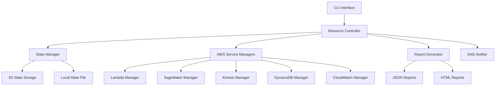

# Design Document: AWS Cost Zero Management System

## Overview

The AWS Cost Zero Management System provides comprehensive control over AWS resource lifecycle to achieve zero billing when resources are not needed. The system consists of CLI scripts, Python-based resource controllers, state management, and integration with existing Terraform infrastructure. It enables administrators to stop all billable resources with a single command and restore them on-demand while preserving data and configurations.

### Key Design Principles

1. **Safety First**: All operations include dry-run mode and confirmation prompts
2. **State Preservation**: Resource configurations are saved before shutdown and restored on startup
3. **Idempotency**: Operations can be safely repeated without side effects
4. **Granularity**: Support for managing all resources or specific resource groups
5. **Observability**: Comprehensive logging and reporting for all operations
6. **Cost Transparency**: Real-time cost estimation and tracking

## Architecture

### High-Level Architecture



### Component Architecture

The system is organized into the following components:

1. **CLI Layer**: Bash scripts providing user interface
2. **Controller Layer**: Python orchestration logic
3. **Service Manager Layer**: AWS service-specific operations
4. **State Management Layer**: Configuration persistence
5. **Reporting Layer**: Cost analysis and operation reports
6. **Notification Layer**: Alerts and status updates

## Components and Interfaces

### 1. CLI Interface

Single unified script for complete resource lifecycle management:

#### `scripts/aws-resource-manager.sh`
Manages all AWS resources related to the User Journey Analytics project.

**Resource Identification:**
- Uses project tags to identify resources: `Project=user-journey-analytics`
- Filters by environment tag if specified: `Environment=dev|staging|prod`
- Only manages resources created by this project's Terraform
- Reads resource names from Terraform state or configuration files

**Commands:**

**Stop Command** - Stops/deletes all billable resources:
- **Kinesis Streams**: Update `user-journey-analytics-user-events` from 2 shards to 1 shard (saves ~$0.36/day)
- **SageMaker Endpoints**: Delete failed `user-journey-analytics-exit-risk-endpoint` (currently $0, but prevents future costs)
- **Lambda Functions**: Set reserved concurrency to 0 for `event_processor`, `intervention-executor` (prevents invocations)
- **CloudWatch Alarms**: Disable all 9 alarms (saves ~$0.03/day)
- **DynamoDB Tables**: Already on-demand mode, no action needed (no idle cost)
- **S3 Buckets**: Keep as-is (minimal storage cost, needed for data)
- **SNS Topics**: Keep as-is (no idle cost)
- Saves complete resource state to `config/aws-resource-state.json`
- Generates cost savings report

**Expected Savings:** ~$0.40/day → ~$12/month

**Start Command** - Recreates/restarts all resources:
- Reads saved state from `config/aws-resource-state.json`
- **Kinesis Streams**: Restore `user-journey-analytics-user-events` to 2 shards
- **SageMaker Endpoints**: Recreate `user-journey-analytics-exit-risk-endpoint` from config (if it was working)
- **Lambda Functions**: Remove concurrency limits on `event_processor`, `intervention-executor`
- **CloudWatch Alarms**: Re-enable all 9 alarms
- **DynamoDB Tables**: No action needed (already on-demand)
- Verifies all resources are operational
- Generates startup status report

**Interface:**
```bash
#!/bin/bash
# Stop all project resources
./scripts/aws-resource-manager.sh stop [--dry-run] [--force]

# Start all project resources
./scripts/aws-resource-manager.sh start [--dry-run]

# Show current status and costs
./scripts/aws-resource-manager.sh status

# Show help
./scripts/aws-resource-manager.sh --help
```

### 2. Resource Controller (`backend/cost-management/controller.py`)

Orchestrates operations across all AWS services.

**Key Methods:**
```python
class ResourceController:
    def stop_all_resources(self, dry_run: bool = False, group: str = None) -> OperationResult
    def start_all_resources(self, dry_run: bool = False, group: str = None) -> OperationResult
    def get_resource_status(self) -> ResourceStatus
    def estimate_costs(self) -> CostEstimate
    def save_state(self) -> bool
    def restore_state(self) -> bool
```

### 3. Service Managers

Each AWS service has a dedicated manager implementing a common interface.

**Base Interface:**
```python
class ServiceManager(ABC):
    @abstractmethod
    def stop(self, dry_run: bool = False) -> ServiceResult
    
    @abstractmethod
    def start(self, dry_run: bool = False) -> ServiceResult
    
    @abstractmethod
    def get_status(self) -> ServiceStatus
    
    @abstractmethod
    def estimate_cost(self) -> float
    
    @abstractmethod
    def save_configuration(self) -> dict
    
    @abstractmethod
    def restore_configuration(self, config: dict) -> bool
```

#### 3.1 Lambda Manager

Manages Lambda function lifecycle and concurrency settings.

**Operations:**
- Stop: Set reserved concurrency to 0, remove provisioned concurrency
- Start: Restore concurrency settings from saved state
- Cost: Calculate based on invocations and duration

#### 3.2 SageMaker Manager

Manages SageMaker endpoints and notebook instances.

**Operations:**
- Stop: Delete endpoints (preserve endpoint configs), stop notebook instances
- Start: Recreate endpoints from configs, start notebook instances
- Cost: Calculate based on instance hours and endpoint usage

#### 3.3 Kinesis Manager

Manages Kinesis Data Streams shard counts.

**Operations:**
- Stop: Update to 1 shard or switch to ON_DEMAND mode with minimal throughput
- Start: Restore original shard count or provisioned throughput
- Cost: Calculate based on shard hours and data throughput


#### 3.4 DynamoDB Manager

Manages DynamoDB table billing modes and capacity.

**Operations:**
- Stop: Switch to on-demand billing mode (no provisioned capacity costs)
- Start: Restore original billing mode and capacity settings
- Cost: Calculate based on billing mode and capacity units

#### 3.5 CloudWatch Manager

Manages CloudWatch alarms and log retention.

**Operations:**
- Stop: Disable alarms (preserve configurations), export logs to S3
- Start: Re-enable alarms, restore log groups
- Cost: Calculate based on log ingestion and storage

### 4. State Manager (`backend/cost-management/state_manager.py`)

Manages persistence of resource configurations.

**State Storage:**
- Primary: Local JSON file at `config/aws-resource-state.json`
- Backup: S3 bucket (if configured)

**State Schema:**
```json
{
  "version": "1.0",
  "timestamp": "2025-10-23T10:30:00Z",
  "project": "user-journey-analytics",
  "environment": "prod",
  "resources": {
    "lambda_functions": [
      {
        "name": "user-journey-analytics-event-processor-prod",
        "reserved_concurrency": 100,
        "provisioned_concurrency": 50,
        "memory_size": 1024,
        "timeout": 300
      }
    ],
    "sagemaker_endpoints": [
      {
        "name": "user-journey-analytics-exit-risk-endpoint-prod",
        "endpoint_config_name": "user-journey-analytics-exit-risk-endpoint-config-prod",
        "instance_type": "ml.m5.large",
        "instance_count": 1
      }
    ],
    "kinesis_streams": [
      {
        "name": "user-journey-analytics-user-events-prod",
        "shard_count": 2,
        "retention_period": 24,
        "stream_mode": "PROVISIONED"
      }
    ],
    "dynamodb_tables": [
      {
        "name": "user-journey-analytics-user-profiles-prod",
        "billing_mode": "PAY_PER_REQUEST",
        "read_capacity": 0,
        "write_capacity": 0
      }
    ],
    "cloudwatch_alarms": [
      {
        "name": "user-journey-analytics-lambda-high-duration-prod",
        "enabled": true
      }
    ]
  }
}
```

**Key Methods:**
```python
class StateManager:
    def save_state(self, resources: dict) -> bool
    def load_state(self) -> dict
    def backup_to_s3(self) -> bool
    def restore_from_s3(self) -> dict
    def validate_state(self, state: dict) -> bool
```

## Data Models

### Resource State Model

```python
@dataclass
class ResourceState:
    version: str
    timestamp: datetime
    project: str
    environment: str
    resources: Dict[str, List[ResourceConfig]]
    
@dataclass
class ResourceConfig:
    name: str
    type: str
    configuration: dict
    tags: dict
```

### Operation Result Model

```python
@dataclass
class OperationResult:
    success: bool
    operation: str  # 'stop' or 'start'
    timestamp: datetime
    resources_affected: List[str]
    errors: List[str]
    warnings: List[str]
    cost_impact: float
    duration_seconds: float
```

### Cost Estimate Model

```python
@dataclass
class CostEstimate:
    hourly_cost: float
    daily_cost: float
    monthly_cost: float
    breakdown: Dict[str, float]  # service -> cost
    timestamp: datetime
```

## Error Handling

### Error Categories

1. **Validation Errors**: Invalid input or state
2. **AWS API Errors**: Service unavailable, throttling, permissions
3. **State Errors**: Missing or corrupted state file
4. **Dependency Errors**: Resources with dependencies that can't be stopped

### Error Handling Strategy

```python
class ErrorHandler:
    def handle_validation_error(self, error: ValidationError) -> None:
        # Log error, display user-friendly message, exit
        
    def handle_aws_error(self, error: AWSError) -> None:
        # Retry with exponential backoff, log, notify
        
    def handle_state_error(self, error: StateError) -> None:
        # Attempt recovery from backup, prompt user
        
    def handle_dependency_error(self, error: DependencyError) -> None:
        # Show dependency chain, ask user for resolution
```

### Retry Logic

- AWS API calls: 3 retries with exponential backoff (1s, 2s, 4s)
- State operations: 2 retries with 1s delay
- Verification checks: 5 retries with 10s delay

## Testing Strategy

### Unit Tests

Test individual service managers and state management:
- Mock AWS API calls using boto3 stubber
- Test state serialization/deserialization
- Test cost calculation logic
- Test error handling paths

### Integration Tests

Test end-to-end workflows:
- Stop and start operations in test AWS account
- State persistence and restoration
- Error recovery scenarios
- Dry-run mode validation

### Manual Testing Checklist

1. Stop all resources and verify zero cost
2. Start all resources and verify functionality
3. Test with missing state file
4. Test with partial failures
5. Test dry-run mode
6. Verify resource tagging filters work correctly
7. Test in different environments (dev, staging, prod)

## Security Considerations

### IAM Permissions

Required permissions for the script:
```json
{
  "Version": "2012-10-17",
  "Statement": [
    {
      "Effect": "Allow",
      "Action": [
        "lambda:GetFunction",
        "lambda:PutFunctionConcurrency",
        "lambda:DeleteFunctionConcurrency",
        "lambda:ListTags"
      ],
      "Resource": "arn:aws:lambda:*:*:function:user-journey-analytics-*"
    },
    {
      "Effect": "Allow",
      "Action": [
        "sagemaker:DescribeEndpoint",
        "sagemaker:DeleteEndpoint",
        "sagemaker:CreateEndpoint",
        "sagemaker:ListTags"
      ],
      "Resource": "arn:aws:sagemaker:*:*:endpoint/user-journey-analytics-*"
    },
    {
      "Effect": "Allow",
      "Action": [
        "kinesis:DescribeStream",
        "kinesis:UpdateShardCount",
        "kinesis:ListTagsForStream"
      ],
      "Resource": "arn:aws:kinesis:*:*:stream/user-journey-analytics-*"
    },
    {
      "Effect": "Allow",
      "Action": [
        "dynamodb:DescribeTable",
        "dynamodb:UpdateTable",
        "dynamodb:ListTagsOfResource"
      ],
      "Resource": "arn:aws:dynamodb:*:*:table/user-journey-analytics-*"
    },
    {
      "Effect": "Allow",
      "Action": [
        "cloudwatch:DescribeAlarms",
        "cloudwatch:DisableAlarmActions",
        "cloudwatch:EnableAlarmActions"
      ],
      "Resource": "*"
    },
    {
      "Effect": "Allow",
      "Action": [
        "s3:PutObject",
        "s3:GetObject"
      ],
      "Resource": "arn:aws:s3:::user-journey-analytics-*/config/*"
    }
  ]
}
```

### State File Security

- State files contain sensitive configuration data
- Store in S3 with encryption at rest
- Use IAM policies to restrict access
- Never commit state files to version control

## Performance Considerations

### Parallel Operations

- Stop/start operations execute in parallel where possible
- Use thread pool for independent resource operations
- Respect AWS API rate limits

### Optimization Strategies

1. **Batch Operations**: Group similar API calls
2. **Caching**: Cache resource descriptions to reduce API calls
3. **Async Operations**: Use async/await for I/O-bound operations
4. **Progress Indicators**: Show progress for long-running operations

## Monitoring and Observability

### Logging

All operations logged to:
- Console output (INFO level)
- Log file: `logs/aws-resource-manager.log` (DEBUG level)
- CloudWatch Logs (if configured)

### Metrics

Track the following metrics:
- Operation duration
- Number of resources affected
- Cost savings achieved
- Error rates
- API call counts

### Notifications

Send notifications via SNS for:
- Successful stop/start operations
- Errors during operations
- Cost threshold breaches
- Scheduled operation completions

## Deployment and Configuration

### Configuration File

`config/aws-resource-manager.conf`:
```bash
# Project identification
PROJECT_NAME="user-journey-analytics"
ENVIRONMENT="prod"

# AWS Configuration
AWS_REGION="us-east-1"
AWS_PROFILE="default"

# State Management
STATE_FILE="config/aws-resource-state.json"
STATE_BACKUP_S3_BUCKET=""  # Optional S3 backup

# Notifications
SNS_TOPIC_ARN=""  # Optional SNS notifications

# Behavior
REQUIRE_CONFIRMATION=true
DRY_RUN_DEFAULT=false
PARALLEL_OPERATIONS=true
MAX_WORKERS=10
```

### Installation

1. Ensure AWS CLI is installed and configured
2. Install Python dependencies: `pip install -r requirements.txt`
3. Configure `config/aws-resource-manager.conf`
4. Make script executable: `chmod +x scripts/aws-resource-manager.sh`
5. Test with dry-run: `./scripts/aws-resource-manager.sh stop --dry-run`

## Future Enhancements

1. **Web Dashboard**: Visual interface for resource management
2. **Cost Forecasting**: Predict future costs based on usage patterns
3. **Automated Scheduling**: Built-in cron-like scheduling
4. **Multi-Region Support**: Manage resources across multiple regions
5. **Resource Groups**: Define custom resource groups for partial operations
6. **Terraform Integration**: Direct integration with Terraform state
