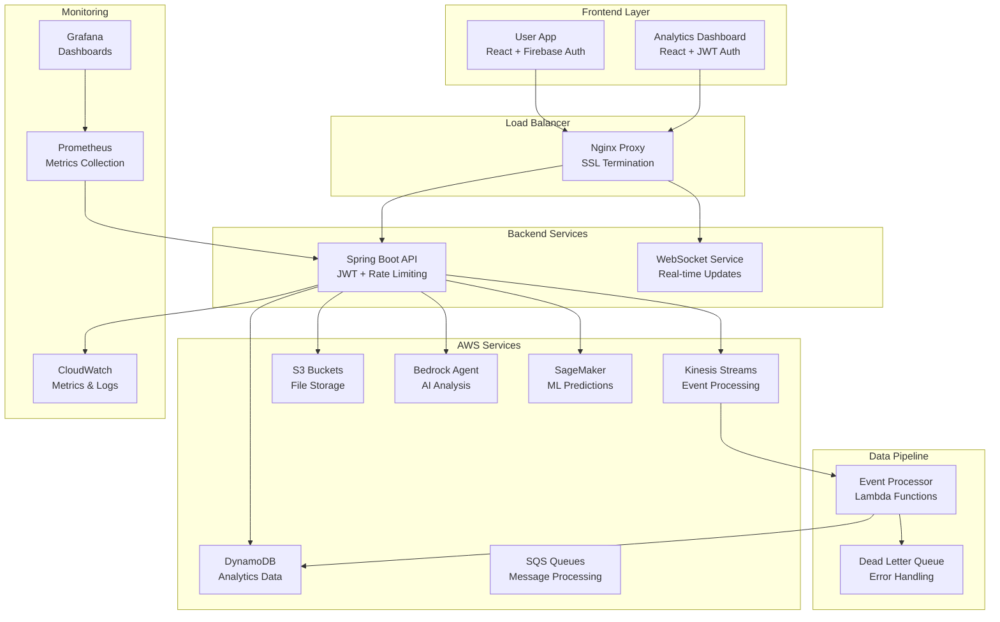

# Production Deployment Design Document

## Overview

This design document outlines the architecture and implementation strategy for deploying the user journey analytics system to production with real-time data capabilities. The system will transition from LocalStack-based development to a fully integrated AWS production environment with proper security, monitoring, and scalability.

## Architecture

### High-Level Architecture



### Component Architecture

#### 1. Frontend Applications
- **User App**: React application with Firebase authentication for end users
- **Analytics Dashboard**: React application with JWT authentication for administrators
- **Load Balancer**: Nginx reverse proxy with SSL termination and routing

#### 2. Backend Services
- **Spring Boot API**: Main application server with JWT authentication and rate limiting
- **WebSocket Service**: Real-time communication for dashboard updates
- **Event Processing**: Kinesis stream processing for user events

#### 3. AWS Infrastructure
- **DynamoDB**: Primary data store for analytics data with GSI indexes
- **Kinesis**: Event streaming for real-time data processing
- **S3**: File storage for documents, logs, and backups
- **SQS**: Message queuing with dead letter queues for reliability
- **Bedrock**: AI agent for intelligent analysis
- **SageMaker**: ML endpoints for predictive analytics

## Components and Interfaces

### 1. Configuration Management

#### Environment-Specific Configuration
```yaml
# application-production.yml
aws:
  region: ${AWS_REGION:us-east-1}
  mock-mode: false
  dynamodb:
    table-prefix: prod-
  kinesis:
    stream-name: user-events-prod
  s3:
    bucket-name: ${S3_BUCKET_NAME}
```

#### Security Configuration
```yaml
app:
  jwt:
    secret: ${JWT_SECRET}
    expiration: 3600
  encryption:
    key: ${ENCRYPTION_KEY}
  rate-limit:
    enabled: true
    requests-per-minute: 1000
```

### 2. Infrastructure as Code

#### Terraform Configuration
- VPC and networking setup
- DynamoDB tables with appropriate indexes
- Kinesis streams with auto-scaling
- S3 buckets with lifecycle policies
- SQS queues with DLQ configuration
- IAM roles and policies
- CloudWatch alarms and dashboards

#### Docker Configuration
- Multi-stage builds for production optimization
- Health checks for container orchestration
- Environment variable injection
- SSL certificate management

### 3. Data Pipeline

#### Event Flow
1. User interactions generate events in the frontend
2. Events are batched and sent to the backend API
3. API validates and forwards events to Kinesis
4. Kinesis triggers Lambda functions for processing
5. Processed data is stored in DynamoDB
6. Dashboard queries DynamoDB for real-time updates

#### Data Models
```typescript
interface UserEvent {
  userId: string;
  sessionId: string;
  eventType: string;
  timestamp: number;
  properties: Record<string, any>;
  metadata: EventMetadata;
}

interface AnalyticsData {
  partitionKey: string;
  sortKey: string;
  eventData: UserEvent;
  processedAt: number;
  ttl?: number;
}
```

### 4. Authentication and Authorization

#### Firebase Integration
- User authentication for the main application
- Token validation and refresh
- User profile management

#### JWT Implementation
- Admin authentication for analytics dashboard
- Role-based access control
- Token expiration and refresh mechanisms

### 5. Real-Time Updates

#### WebSocket Implementation
- Real-time dashboard updates
- Connection management and reconnection
- Event broadcasting to connected clients

#### Caching Strategy
- Redis for session management
- Application-level caching for frequently accessed data
- CDN integration for static assets

## Data Models

### DynamoDB Schema Design

#### Primary Tables

**UserEvents Table**
```
Partition Key: userId
Sort Key: timestamp
Attributes: eventType, sessionId, properties, metadata
GSI1: eventType (PK) | timestamp (SK)
GSI2: sessionId (PK) | timestamp (SK)
```

**UserSessions Table**
```
Partition Key: sessionId
Sort Key: userId
Attributes: startTime, endTime, eventCount, metadata
GSI1: userId (PK) | startTime (SK)
```

**AnalyticsSummary Table**
```
Partition Key: date
Sort Key: metricType
Attributes: value, metadata, calculatedAt
```

### S3 Bucket Structure
```
user-journey-analytics-prod/
├── raw-events/
│   └── year=2024/month=12/day=14/
├── processed-data/
│   └── aggregations/
├── backups/
│   └── dynamodb-exports/
└── logs/
    └── application-logs/
```

## Error Handling

### Circuit Breaker Pattern
- Implement circuit breakers for external service calls
- Graceful degradation when services are unavailable
- Automatic recovery and health checks

### Dead Letter Queue Processing
- Failed event processing goes to DLQ
- Automated retry mechanisms with exponential backoff
- Manual intervention capabilities for persistent failures

### Monitoring and Alerting
- CloudWatch metrics for all components
- Custom dashboards for business metrics
- Automated alerts for system health issues

## Testing Strategy

### Integration Testing
- End-to-end testing with real AWS services in staging
- Load testing for expected production traffic
- Disaster recovery testing

### Security Testing
- Authentication and authorization testing
- Rate limiting validation
- Data encryption verification

### Performance Testing
- Database query optimization
- API response time validation
- Real-time update latency testing

## Deployment Strategy

### Blue-Green Deployment
- Zero-downtime deployments
- Quick rollback capabilities
- Database migration strategies

### Infrastructure Deployment
1. Terraform infrastructure provisioning
2. Database schema migrations
3. Application deployment
4. Configuration validation
5. Health check verification

### Monitoring and Rollback
- Automated health checks post-deployment
- Performance monitoring during deployment
- Automated rollback triggers for critical failures

## Security Considerations

### Data Protection
- Encryption at rest for all data stores
- Encryption in transit for all communications
- PII data handling and anonymization

### Access Control
- IAM roles with least privilege principle
- VPC security groups and NACLs
- API rate limiting and DDoS protection

### Compliance
- Data retention policies
- Audit logging for all data access
- GDPR compliance for user data handling

## Performance Optimization

### Database Optimization
- DynamoDB capacity planning and auto-scaling
- Query optimization with proper indexes
- Connection pooling and caching

### API Optimization
- Response caching strategies
- Pagination for large datasets
- Asynchronous processing for heavy operations

### Frontend Optimization
- Code splitting and lazy loading
- CDN integration for static assets
- Progressive web app capabilities