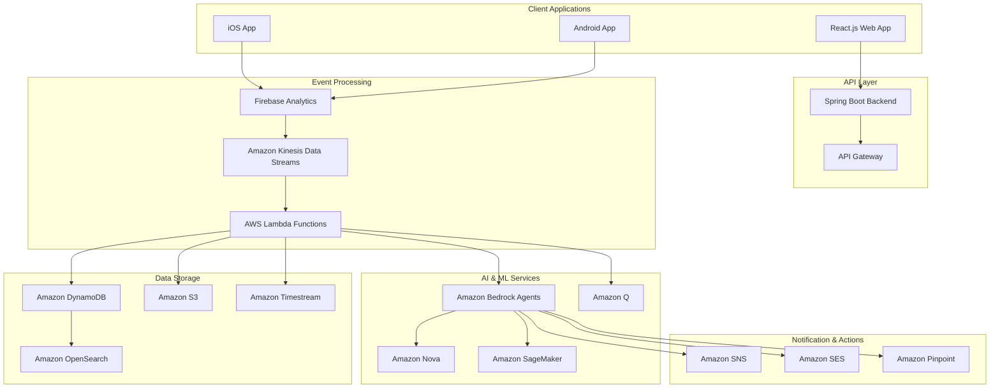
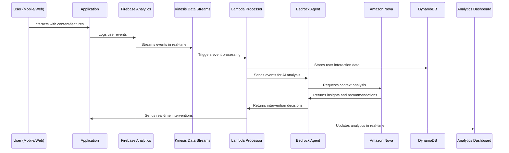

# Design Document: Intelligent User Journey Orchestrator

## Overview

The Intelligent User Journey Orchestrator is a sophisticated AI-powered system that provides real-time user behavior analysis, predictive analytics, and automated interventions for mobile and web applications. The system leverages AWS AI services, real-time data processing, and machine learning to create a comprehensive understanding of user journeys and optimize user experience through intelligent automation.

### Key Design Principles

- **Real-time Processing**: Sub-5-second response time for struggle detection and interventions
- **Scalable Architecture**: Auto-scaling capabilities to handle growing user bases
- **AI-First Approach**: Autonomous decision-making with human oversight
- **Privacy-Compliant**: GDPR and CCPA compliant data handling
- **Cost-Optimized**: Efficient resource utilization with AWS managed services

## Architecture

### High-Level System Architecture



### Data Flow Architecture



## Components and Interfaces

### 1. Event Collection Layer

#### Firebase Analytics Integration
```typescript
interface UserEvent {
  eventType: 'page_view' | 'video_engagement' | 'feature_interaction' | 'struggle_signal';
  userId: string;
  sessionId: string;
  timestamp: number;
  eventData: {
    feature?: string;
    videoId?: string;
    duration?: number;
    completionRate?: number;
    attemptCount?: number;
    errorType?: string;
  };
  deviceInfo: {
    platform: 'iOS' | 'Android' | 'Web';
    appVersion: string;
    deviceModel: string;
  };
  userContext: {
    userSegment: string;
    sessionStage: string;
    previousActions: string[];
  };
}
```

#### Spring Boot Event API
```java
@RestController
@RequestMapping("/api/events")
public class EventController {
    
    @PostMapping("/track")
    public ResponseEntity<Void> trackEvent(@RequestBody UserEvent event) {
        // Validate and enrich event data
        // Send to Kinesis Data Streams
        // Return immediate response
    }
    
    @GetMapping("/user/{userId}/insights")
    public ResponseEntity<UserInsights> getUserInsights(@PathVariable String userId) {
        // Retrieve real-time user insights from DynamoDB
        // Include struggle signals, preferences, and recommendations
    }
}
```

### 2. Real-time Processing Layer

#### AWS Lambda Event Processor
```python
import json
import boto3
from datetime import datetime, timedelta

class EventProcessor:
    def __init__(self):
        self.bedrock_agent = boto3.client('bedrock-agent-runtime')
        self.dynamodb = boto3.resource('dynamodb')
        self.timestream = boto3.client('timestream-write')
        
    def process_event(self, event_record):
        """Process individual user event and trigger AI analysis"""
        user_event = json.loads(event_record['body'])
        
        # Store in DynamoDB for real-time access
        self.store_user_event(user_event)
        
        # Store time-series data in Timestream
        self.store_time_series_data(user_event)
        
        # Trigger struggle signal detection
        if self.detect_struggle_signal(user_event):
            self.trigger_intervention(user_event)
            
        # Update user profile and preferences
        self.update_user_profile(user_event)
        
        # Trigger predictive analysis
        self.analyze_exit_risk(user_event['userId'])
    
    def detect_struggle_signal(self, event):
        """Detect if user is struggling with a feature"""
        if event['eventType'] == 'feature_interaction':
            attempt_count = event['eventData'].get('attemptCount', 1)
            if attempt_count >= 2:
                return True
        return False
    
    def trigger_intervention(self, event):
        """Trigger AI agent intervention through Bedrock"""
        intervention_request = {
            'userId': event['userId'],
            'struggleType': event['eventData']['feature'],
            'attemptCount': event['eventData']['attemptCount'],
            'context': event['userContext']
        }
        
        response = self.bedrock_agent.invoke_agent(
            agentId='user-journey-agent',
            sessionId=event['sessionId'],
            inputText=json.dumps(intervention_request)
        )
        
        return response
```

### 3. AI Decision Engine

#### Amazon Bedrock Agent Configuration
```json
{
  "agentName": "UserJourneyOrchestrator",
  "description": "AI agent for user journey analysis and intervention",
  "foundationModel": "anthropic.claude-3-sonnet-20240229-v1:0",
  "instruction": "You are an intelligent user journey orchestrator. Analyze user behavior patterns, detect struggle signals, and recommend appropriate interventions to improve user experience and prevent drop-offs.",
  "actionGroups": [
    {
      "actionGroupName": "StruggleDetection",
      "description": "Detect and respond to user struggle signals",
      "actionGroupExecutor": {
        "lambda": "arn:aws:lambda:region:account:function:struggle-detector"
      },
      "apiSchema": {
        "payload": "struggle-detection-schema.json"
      }
    },
    {
      "actionGroupName": "VideoIntelligence",
      "description": "Analyze video engagement patterns",
      "actionGroupExecutor": {
        "lambda": "arn:aws:lambda:region:account:function:video-analyzer"
      }
    },
    {
      "actionGroupName": "InterventionEngine",
      "description": "Execute user interventions",
      "actionGroupExecutor": {
        "lambda": "arn:aws:lambda:region:account:function:intervention-executor"
      }
    }
  ],
  "knowledgeBases": [
    {
      "knowledgeBaseId": "user-behavior-patterns",
      "description": "Historical user behavior patterns and successful interventions"
    }
  ]
}
```

#### Amazon Nova Integration for Context Analysis
```python
class NovaContextAnalyzer:
    def __init__(self):
        self.nova_client = boto3.client('bedrock-runtime')
    
    def analyze_user_context(self, user_events, user_profile):
        """Use Amazon Nova to analyze user context and generate insights"""
        
        context_prompt = f"""
        Analyze the following user behavior data and provide insights:
        
        User Profile: {json.dumps(user_profile)}
        Recent Events: {json.dumps(user_events[-10:])}
        
        Please provide:
        1. User intent analysis
        2. Engagement level assessment
        3. Risk factors for drop-off
        4. Personalization recommendations
        5. Next best actions
        """
        
        response = self.nova_client.invoke_model(
            modelId='amazon.nova-micro-v1:0',
            body=json.dumps({
                'inputText': context_prompt,
                'textGenerationConfig': {
                    'maxTokenCount': 1000,
                    'temperature': 0.3
                }
            })
        )
        
        return json.loads(response['body'].read())
```

### 4. Machine Learning Models

#### SageMaker Exit Risk Prediction Model
```python
import sagemaker
from sagemaker.sklearn.estimator import SKLearn

class ExitRiskPredictor:
    def __init__(self):
        self.sagemaker_session = sagemaker.Session()
        self.role = sagemaker.get_execution_role()
        
    def train_exit_risk_model(self):
        """Train ML model to predict user exit risk"""
        
        # Feature engineering for exit risk prediction
        features = [
            'struggle_signal_count_7d',
            'video_engagement_score',
            'feature_completion_rate',
            'session_frequency_trend',
            'support_interaction_count',
            'days_since_last_login',
            'application_progress_percentage'
        ]
        
        sklearn_estimator = SKLearn(
            entry_point='exit_risk_model.py',
            framework_version='0.23-1',
            instance_type='ml.m5.large',
            role=self.role,
            hyperparameters={
                'n_estimators': 100,
                'max_depth': 10,
                'random_state': 42
            }
        )
        
        sklearn_estimator.fit({'training': 's3://bucket/training-data'})
        
        return sklearn_estimator.deploy(
            initial_instance_count=1,
            instance_type='ml.t2.medium'
        )
    
    def predict_exit_risk(self, user_features):
        """Predict exit risk score for a user"""
        predictor = sagemaker.predictor.Predictor(
            endpoint_name='exit-risk-predictor'
        )
        
        risk_score = predictor.predict(user_features)
        return {
            'riskScore': float(risk_score[0]),
            'riskLevel': self.categorize_risk(risk_score[0]),
            'recommendedActions': self.get_risk_actions(risk_score[0])
        }
    
    def categorize_risk(self, score):
        if score < 30:
            return 'LOW'
        elif score < 60:
            return 'MEDIUM'
        else:
            return 'HIGH'
```

### 5. Data Storage Layer

#### DynamoDB Schema Design
```python
# User Profiles Table
user_profiles_table = {
    'TableName': 'UserProfiles',
    'KeySchema': [
        {'AttributeName': 'userId', 'KeyType': 'HASH'}
    ],
    'AttributeDefinitions': [
        {'AttributeName': 'userId', 'AttributeType': 'S'}
    ],
    'GlobalSecondaryIndexes': [
        {
            'IndexName': 'UserSegmentIndex',
            'KeySchema': [
                {'AttributeName': 'userSegment', 'KeyType': 'HASH'}
            ]
        }
    ]
}

# User Events Table
user_events_table = {
    'TableName': 'UserEvents',
    'KeySchema': [
        {'AttributeName': 'userId', 'KeyType': 'HASH'},
        {'AttributeName': 'timestamp', 'KeyType': 'RANGE'}
    ],
    'AttributeDefinitions': [
        {'AttributeName': 'userId', 'AttributeType': 'S'},
        {'AttributeName': 'timestamp', 'AttributeType': 'N'}
    ],
    'TimeToLiveSpecification': {
        'AttributeName': 'ttl',
        'Enabled': True
    }
}

# Struggle Signals Table
struggle_signals_table = {
    'TableName': 'StruggleSignals',
    'KeySchema': [
        {'AttributeName': 'userId', 'KeyType': 'HASH'},
        {'AttributeName': 'featureId', 'KeyType': 'RANGE'}
    ],
    'GlobalSecondaryIndexes': [
        {
            'IndexName': 'FeatureStruggleIndex',
            'KeySchema': [
                {'AttributeName': 'featureId', 'KeyType': 'HASH'},
                {'AttributeName': 'struggleCount', 'KeyType': 'RANGE'}
            ]
        }
    ]
}
```

#### Amazon Timestream for Time-Series Analytics
```python
class TimestreamManager:
    def __init__(self):
        self.timestream_write = boto3.client('timestream-write')
        self.timestream_query = boto3.client('timestream-query')
        
    def write_video_engagement_metrics(self, user_id, video_id, metrics):
        """Store video engagement time-series data"""
        
        records = [
            {
                'Time': str(int(time.time() * 1000)),
                'TimeUnit': 'MILLISECONDS',
                'Dimensions': [
                    {'Name': 'userId', 'Value': user_id},
                    {'Name': 'videoId', 'Value': video_id}
                ],
                'MeasureName': 'video_engagement',
                'MeasureValue': str(metrics['watchDuration']),
                'MeasureValueType': 'DOUBLE'
            }
        ]
        
        self.timestream_write.write_records(
            DatabaseName='UserJourneyAnalytics',
            TableName='VideoEngagement',
            Records=records
        )
    
    def query_user_engagement_trends(self, user_id, days=7):
        """Query user engagement trends over time"""
        
        query = f"""
        SELECT 
            bin(time, 1h) as hour,
            AVG(measure_value::double) as avg_engagement,
            COUNT(*) as interaction_count
        FROM "UserJourneyAnalytics"."VideoEngagement"
        WHERE userId = '{user_id}'
        AND time >= ago({days}d)
        GROUP BY bin(time, 1h)
        ORDER BY hour DESC
        """
        
        response = self.timestream_query.query(QueryString=query)
        return response['Rows']
```

## Data Models

### Core Data Models

#### User Profile Model
```typescript
interface UserProfile {
  userId: string;
  createdAt: Date;
  lastActiveAt: Date;
  userSegment: 'new_user' | 'active_user' | 'at_risk' | 'churned';
  preferences: {
    contentCategories: string[];
    videoTopics: string[];
    preferredInteractionStyle: 'guided' | 'self_service' | 'assisted';
  };
  behaviorMetrics: {
    totalSessions: number;
    avgSessionDuration: number;
    featureAdoptionRate: number;
    supportInteractionCount: number;
  };
  riskFactors: {
    exitRiskScore: number;
    lastRiskAssessment: Date;
    riskContributors: string[];
  };
  interventionHistory: InterventionRecord[];
}
```

#### Video Engagement Model
```typescript
interface VideoEngagement {
  userId: string;
  videoId: string;
  engagementData: {
    viewCount: number;
    totalWatchTime: number;
    completionRate: number;
    segmentsReplayed: TimeRange[];
    pausePoints: number[];
    skipSegments: TimeRange[];
    playbackSpeed: number;
  };
  contextData: {
    accessedFrom: string;
    deviceType: string;
    sessionStage: string;
    postViewActions: string[];
  };
  intelligenceMetrics: {
    interestScore: number;
    comprehensionIndicators: string[];
    readinessSignals: string[];
  };
}
```

#### Struggle Signal Model
```typescript
interface StruggleSignal {
  userId: string;
  featureId: string;
  detectedAt: Date;
  signalType: 'repeated_attempts' | 'error_pattern' | 'abandonment' | 'help_seeking';
  severity: 'low' | 'medium' | 'high' | 'critical';
  context: {
    attemptCount: number;
    timeSpent: number;
    errorsEncountered: string[];
    userActions: string[];
  };
  interventionTriggered: boolean;
  interventionType?: string;
  resolved: boolean;
  resolutionTime?: number;
}
```

## Error Handling

### Error Handling Strategy

#### 1. Event Processing Errors
```python
class EventProcessingErrorHandler:
    def __init__(self):
        self.dead_letter_queue = boto3.client('sqs')
        self.cloudwatch = boto3.client('cloudwatch')
    
    def handle_processing_error(self, event, error):
        """Handle errors in event processing with retry logic"""
        
        # Log error details
        self.cloudwatch.put_metric_data(
            Namespace='UserJourneyOrchestrator',
            MetricData=[
                {
                    'MetricName': 'ProcessingErrors',
                    'Value': 1,
                    'Unit': 'Count',
                    'Dimensions': [
                        {'Name': 'ErrorType', 'Value': type(error).__name__}
                    ]
                }
            ]
        )
        
        # Implement exponential backoff retry
        if event.get('retryCount', 0) < 3:
            event['retryCount'] = event.get('retryCount', 0) + 1
            # Re-queue with delay
            return self.requeue_with_delay(event)
        else:
            # Send to dead letter queue for manual review
            return self.send_to_dlq(event, error)
```

#### 2. AI Service Fallbacks
```python
class AIServiceFallbackHandler:
    def __init__(self):
        self.fallback_rules = {
            'bedrock_unavailable': self.use_rule_based_decisions,
            'nova_timeout': self.use_cached_insights,
            'sagemaker_error': self.use_statistical_models
        }
    
    def handle_ai_service_error(self, service, error, context):
        """Provide fallback when AI services are unavailable"""
        
        fallback_key = f"{service}_{error.error_code}"
        if fallback_key in self.fallback_rules:
            return self.fallback_rules[fallback_key](context)
        
        # Default fallback: use rule-based logic
        return self.use_rule_based_decisions(context)
    
    def use_rule_based_decisions(self, context):
        """Fallback to rule-based decision making"""
        # Implement simple rule-based logic for critical decisions
        pass
```

#### 3. Data Consistency Handling
```python
class DataConsistencyHandler:
    def __init__(self):
        self.dynamodb = boto3.resource('dynamodb')
    
    def ensure_data_consistency(self, user_id, event_data):
        """Ensure data consistency across multiple storage systems"""
        
        try:
            # Use DynamoDB transactions for consistency
            with self.dynamodb.Table('UserProfiles').batch_writer() as batch:
                # Update user profile
                batch.put_item(Item=event_data['user_profile'])
                
                # Update event history
                batch.put_item(Item=event_data['event_record'])
                
        except ClientError as e:
            if e.response['Error']['Code'] == 'TransactionCanceledException':
                # Handle transaction conflicts
                return self.handle_transaction_conflict(user_id, event_data)
            raise
```

## Testing Strategy

### 1. Unit Testing

#### Lambda Function Testing
```python
import pytest
from moto import mock_dynamodb, mock_kinesis
from event_processor import EventProcessor

@mock_dynamodb
@mock_kinesis
class TestEventProcessor:
    def setup_method(self):
        self.processor = EventProcessor()
        self.setup_mock_tables()
    
    def test_struggle_signal_detection(self):
        """Test struggle signal detection logic"""
        event = {
            'eventType': 'feature_interaction',
            'userId': 'test_user',
            'eventData': {'attemptCount': 3, 'feature': 'document_upload'}
        }
        
        result = self.processor.detect_struggle_signal(event)
        assert result == True
    
    def test_video_engagement_analysis(self):
        """Test video engagement analysis"""
        video_event = {
            'eventType': 'video_engagement',
            'userId': 'test_user',
            'eventData': {
                'videoId': 'tutorial_1',
                'watchDuration': 120,
                'completionRate': 85
            }
        }
        
        insights = self.processor.analyze_video_engagement(video_event)
        assert insights['interestScore'] > 0
```

### 2. Integration Testing

#### End-to-End Flow Testing
```python
class TestUserJourneyFlow:
    def test_complete_user_journey(self):
        """Test complete user journey from event to intervention"""
        
        # 1. Simulate user struggle
        struggle_event = self.create_struggle_event()
        
        # 2. Process through Lambda
        response = self.lambda_client.invoke(
            FunctionName='event-processor',
            Payload=json.dumps(struggle_event)
        )
        
        # 3. Verify intervention was triggered
        interventions = self.get_user_interventions('test_user')
        assert len(interventions) > 0
        
        # 4. Verify analytics were updated
        analytics = self.get_user_analytics('test_user')
        assert analytics['struggleSignalCount'] > 0
```

### 3. Performance Testing

#### Load Testing Configuration
```python
class PerformanceTestSuite:
    def test_event_processing_throughput(self):
        """Test system can handle required event throughput"""
        
        # Simulate 1000 events per second
        events = self.generate_test_events(count=1000)
        
        start_time = time.time()
        for event in events:
            self.kinesis_client.put_record(
                StreamName='user-events',
                Data=json.dumps(event),
                PartitionKey=event['userId']
            )
        
        processing_time = time.time() - start_time
        assert processing_time < 5.0  # Should process within 5 seconds
    
    def test_real_time_response_latency(self):
        """Test real-time intervention response time"""
        
        struggle_event = self.create_high_priority_struggle_event()
        
        start_time = time.time()
        self.send_event(struggle_event)
        
        # Wait for intervention
        intervention = self.wait_for_intervention('test_user')
        response_time = time.time() - start_time
        
        assert response_time < 5.0  # Must respond within 5 seconds
        assert intervention is not None
```

### 4. AI Model Testing

#### Model Accuracy Testing
```python
class AIModelTestSuite:
    def test_exit_risk_prediction_accuracy(self):
        """Test exit risk prediction model accuracy"""
        
        test_data = self.load_test_dataset()
        predictions = []
        actuals = []
        
        for user_data in test_data:
            prediction = self.exit_risk_predictor.predict(user_data['features'])
            predictions.append(prediction['riskScore'])
            actuals.append(user_data['actual_exit'])
        
        accuracy = self.calculate_accuracy(predictions, actuals)
        assert accuracy > 0.85  # Require 85% accuracy
    
    def test_intervention_effectiveness(self):
        """Test that interventions improve user outcomes"""
        
        # Compare users who received interventions vs control group
        intervention_group = self.get_intervention_group_outcomes()
        control_group = self.get_control_group_outcomes()
        
        improvement = (intervention_group['conversion_rate'] - 
                      control_group['conversion_rate'])
        
        assert improvement > 0.1  # Require 10% improvement
```

This comprehensive design document provides a detailed technical blueprint for implementing the Intelligent User Journey Orchestrator, covering all aspects from architecture and data models to error handling and testing strategies. The design ensures scalability, reliability, and compliance with AWS best practices while meeting all the requirements specified in the requirements document.